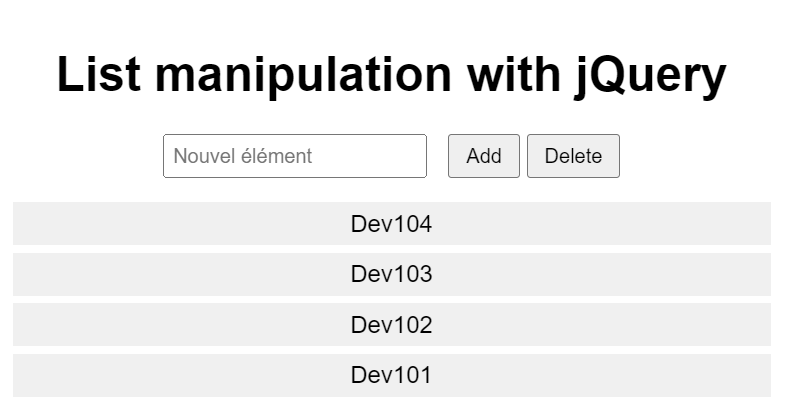

# Dynamic-List-Manipulation-with-jQuery

## Description
This web page allows users to dynamically add and remove items from a list using jQuery. The interface consists of an input field for entering list items, and buttons for adding or removing items from the list. The design is simple and centered, making it easy to interact with.

### Components:

1. **HTML Structure**:
    - **Heading**: A header (`<h1>`) titled "Manipulation de Liste avec jQuery".
    - **Input Field**: A text input (`<input>`) for entering new list items.
    - **Buttons**: Two buttons for adding ("Ajouter") and removing ("Supprimer") list items.
    - **Unordered List**: An empty list (`<ul>`) with the ID `#maListe` that will be dynamically populated.

2. **CSS Styling**:
    - The page uses a clean, centered design with a modern sans-serif font.
    - Input fields and buttons are styled for clarity and ease of use, with padding and margins for spacing.
    - List items have a background color and padding to visually distinguish them.

3. **JavaScript (jQuery)**:
    - **Document Ready**: Ensures the jQuery code runs only after the document is fully loaded.
    - **Add Item Functionality**: 
        - The "Ajouter" button appends a new list item (`<li>`) with the value entered in the input field.
        - After adding the item, the input field is cleared.
    - **Remove Item Functionality**: 
        - The "Supprimer" button removes list items that contain the text entered in the input field.
        - After removing the item(s), the input field is cleared.

### Features:
- **Dynamic List Manipulation**: Users can add or remove items from the list in real-time.
- **Intuitive Interface**: Simple input field and buttons make the functionality easy to understand and use.
- **Immediate Feedback**: List updates are reflected immediately upon button clicks.

### Usage:
- **Add Item**: Enter a text value in the input field and click the "Ajouter" button to add the item to the list.
- **Remove Item**: Enter the text value of the item to be removed in the input field and click the "Supprimer" button to remove it from the list.

This example demonstrates basic jQuery functionality for dynamically manipulating list items, providing a simple and effective way to interact with and manage lists on a web page.
